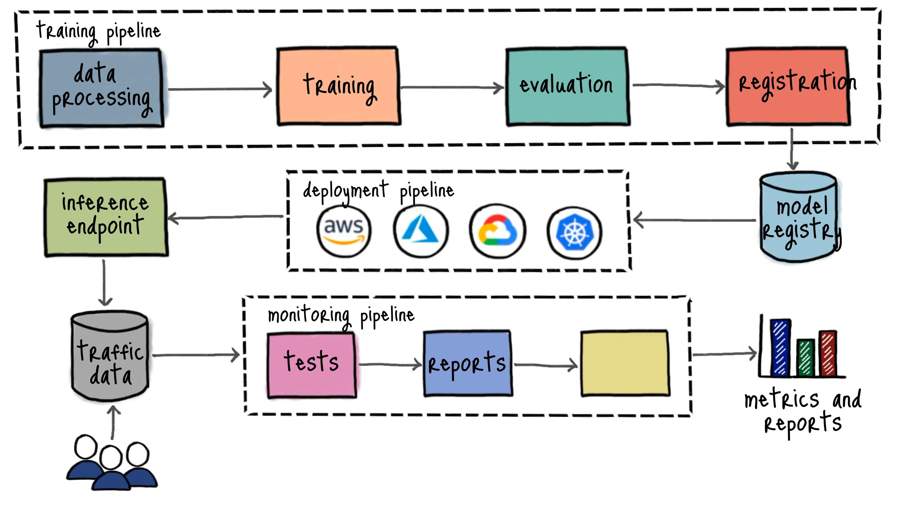
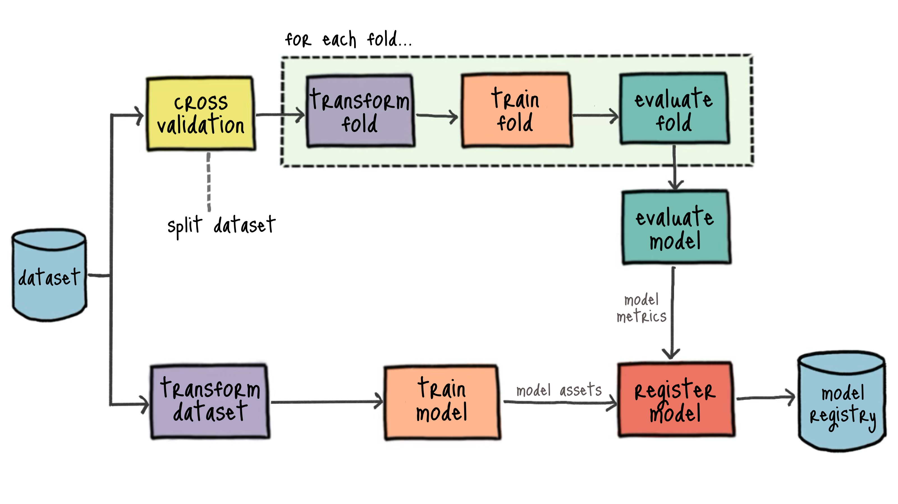
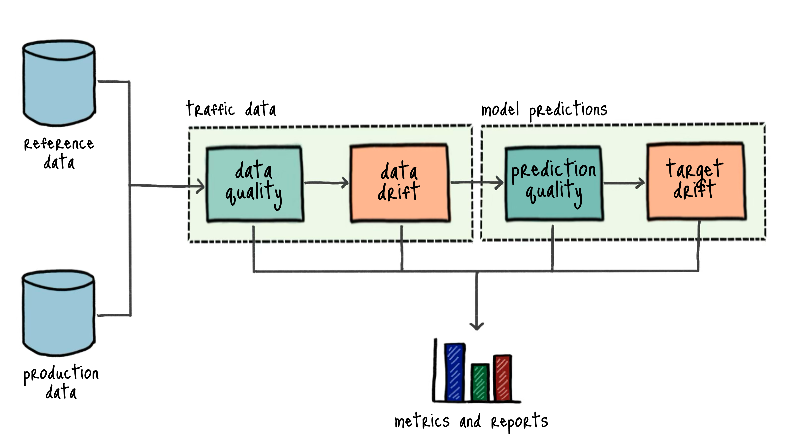

# Building Machine Learning Systems

"Building Machine Learning Systems" is designed to teach you how to train, evaluate, deploy, and monitor machine learning models in production. 

In this repository, you'll find the code to build a fully-fledged, end-to-end machine learning system that you can use as a starting point for your own projects.

The code in this repository uses the [Penguins dataset](https://www.kaggle.com/parulpandey/palmer-archipelago-antarctica-penguin-data) to train a model to classify penguin species.


This repository is part of the [Machine Learning School](https://www.ml.school) program.

If you find any problems with the code or have any ideas on improving it, please open an issue and share your recommendations.

## Table of Contents

- [Getting Started](#getting-started)
- [High-level Architecture](#high-level-architecture)
- [Preparing Your Environment](#preparing-your-environment)
- [Running MLflow](#running-mlflow)
- [Training The Model](#training-the-model)
- [Visualizing Pipeline Results](#visualizing-pipeline-results)
- [Deploying The Model](#deploying-the-model)
- [Monitoring The Model](#monitoring-the-model)
- [Production Pipelines in Amazon Web Services](#production-pipelines-in-amazon-web-services)
  - [Running a remote MLflow server in EC2](#running-a-remote-mlflow-server-in-ec2)
  - [Deploying the model to SageMaker](#deploying-the-model-to-sagemaker)
  - [Monitoring the model in SageMaker](#monitoring-the-model-in-sagemaker)
  - [Deploying to AWS Managed Services](#deploying-to-aws-managed-services)
  - [Cleaning up AWS resources](#cleaning-up-aws-resources)
- [Production Pipelines in Azure](#production-pipelines-in-azure)
  - [Deploying the model to Azure](#deploying-the-model-to-azure)
  - [Cleaning up Azure resources](#cleaning-up-azure-resources)

## Getting Started

The simplest way to start is to open the project using Google's Project IDX by clicking the button below. Project IDX will create and configure a development environment you can access directly from your browser:

<a href="https://idx.google.com/new?template=https%3A%2F%2Fgithub.com%2Fsvpino%2Fml.school%2F">
  
</a>

Opening the project in IDX will significantly reduce the time needed to set it up on your local computer. You'll be up and running in a few seconds and won't have to install anything on your environment.

## High-level Architecture

The code in this repository implements some of the most critical components of a machine learning system. Here is a high-level architecture diagram showing the different pieces:



This guide provides instructions on how to implement each component of the solution and how to deploy the system locally and on different cloud platforms.

## Preparing Your Environment

If you prefer to run the project on your local environment, you can start by 
[forking](https://docs.github.com/en/pull-requests/collaborating-with-pull-requests/working-with-forks/fork-a-repo) the [repository](https://github.com/svpino/ml.school) and [cloning](https://docs.github.com/en/pull-requests/collaborating-with-pull-requests/working-with-forks/fork-a-repo) it on your computer. This will allow you to modify the code and push any changes to your repository.

You can run the code on any Unix-based operating system (e.g., Ubuntu or macOS). If you are using Windows, install the [Windows Subsystem for Linux](https://learn.microsoft.com/en-us/windows/wsl/about) (WSL).

The code was written using **Python 3.12**, so make sure you have this [version](https://www.python.org/downloads/release/python-3126/) installed. Python 3.13 or above will fail to install this repository.

After cloning the repository, navigate to the root directory and create and activate a virtual environment. We'll install all the required libraries inside this virtual environment, preventing any conflicts with other projects you might have on your computer:

```shell
python3 -m venv .venv
source .venv/bin/activate
```

Now, within the virtual environment, you can update `pip` and install the libraries specified in the `requirements.txt` file:

```shell
pip3 install -U pip && pip3 install -r requirements.txt
```

At this point, you should have a working Python environment with all the required dependencies. The final step is to create an `.env` file inside the repository's root directory. We'll use this file to define the environment variables we need to run the pipelines:

```shell
echo "KERAS_BACKEND=jax" >> .env
```

Finally, we'll use the [`jq`](https://jqlang.github.io/jq/) command-line JSON processor to simplify some commands when working with different cloud environments and [`docker`](https://docs.docker.com/engine/install/) to deploy the model to the cloud. Make sure you have both tools installed in your system.

## Running MLflow

[MLflow](https://mlflow.org/) is a platform-agnostic machine learning lifecycle management tool that will help you track experiments and share and deploy models.

To run an MLflow server locally, open a terminal window, activate the virtual environment you created earlier, and run the following command:

```shell
mlflow server --host 127.0.0.1 --port 5000
```

Once running, you can navigate to [`http://127.0.0.1:5000`](http://127.0.0.1:5000) in your web browser to open MLflow's user interface.

By default, MLflow tracks experiments and stores data in files inside a local `./mlruns` directory. You can change the location of the tracking directory or use a SQLite database using the parameter `--backend-store-uri`. The following example uses a SQLite database to store the tracking data:

```shell
mlflow server --host 127.0.0.1 --port 5000 \
   --backend-store-uri sqlite:///mlflow.db
```

For more information, check some of the [common ways to set up MLflow](https://mlflow.org/docs/latest/tracking.html#common-setups). You can also run the following command to get more information about the server:

```shell
mlflow server --help
```

After the server is running, modify the `.env` file inside the repository's root directory to add the `MLFLOW_TRACKING_URI` environment variable pointing to the tracking URI of the MLflow server. The following command will append the variable to the file and export it in your current shell:

```shell
export $((echo "MLFLOW_TRACKING_URI=http://127.0.0.1:5000" >> .env; cat .env) | xargs)
```

## Training The Model

The training pipeline trains, evaluates and registers a model in the [MLflow Model Registry](https://mlflow.org/docs/latest/model-registry.html).



We'll use [Metaflow](https://metaflow.org), an open-source Python library, to orchestrate the pipeline, run it, and track the data it generates.

To learn more about how to use Metaflow, check out the [Metaflow Sandbox](https://docs.outerbounds.com/sandbox/). You can create your own sandbox account and follow a hands-on, step-by-step tutorial to learn how to use the library.

In this section, we will run and orchestrate the training pipeline locally. Later sections of this guide explain how to run the pipeline in a distributed environment.

You can run the training pipeline using the following command from the repository's root directory:

```shell
python3 pipelines/training.py --environment=pypi run
```

This pipeline will load and transform the `./data/penguins.csv` dataset, train a model, use cross-validation to evaluate its performance and register the model in the MLflow Model Registry. After the pipeline runs, you should see a new version of the `penguins` model in the Model Registry.

The pipeline will register the model only if its accuracy is above a predefined threshold. By default, the threshold is set to `0.7`, but you can change it by specifying the `accuracy-threshold` parameter when running the pipeline:

```shell
python3 pipelines/training.py --environment=pypi run \
    --accuracy-threshold 0.9
```

The example above will only register the model if its accuracy is above 90%.

You can show the supported parameters for the Training flow by running the following command:

```shell
python3 pipelines/training.py --environment=pypi run --help
```

## Visualizing Pipeline Results

We can observe the execution of each pipeline and visualize their results live using [Metaflow Cards](https://docs.metaflow.org/metaflow/visualizing-results). Metaflow will set up a local server for viewing these cards as the pipeline runs.

To open the built-in card server for the Training pipeline, navigate to your repository's root directory in a new terminal window and run this command:

```shell
python3 pipelines/training.py --environment=pypi card server
```

Open your browser and navigate to [localhost:8324](http://localhost:8324/).  Every time you run the Training pipeline, the viewer will automatically update to show the cards related to the latest pipeline execution.

Check [Using Local Card Viewer](https://docs.metaflow.org/metaflow/visualizing-results/effortless-task-inspection-with-default-cards#using-local-card-viewer) for more information about the local card viewer.

## Deploying The Model

To deploy your model locally, you can use the `mflow models serve` command specifying the model version you want to deploy from the Model Registry. You can find more information about local deployments in [Deploy MLflow Model as a Local Inference Server](https://mlflow.org/docs/latest/deployment/deploy-model-locally.html).

The command below starts a local server listening in port `8080`. This server will host the latest version of the model from the Model Registry:

```shell
mlflow models serve \
    -m models:/penguins/$(
        curl -s -X GET "$MLFLOW_TRACKING_URI""/api/2.0/"\
"mlflow/registered-models/"\
"get-latest-versions" \
            -H "Content-Type: application/json" \
            -d '{"name": "penguins"}' | \
        jq -r '.model_versions[0].version'
    ) -h 0.0.0.0 -p 8080 --no-conda
```

By default, MLflow uses [Flask](https://flask.palletsprojects.com/en/1.1.x/) to serve the inference endpoint. Flask is a lightweight web framework and might not be suitable for production use cases. If you need a more robust and scalable inference server, you can use [MLServer](https://mlserver.readthedocs.io/en/latest/), an open-source project that provides a standardized interface for deploying and serving models.

To deploy the model using MLServer, execute the `mlflow models serve` command above with the `--enable-mlserver` option.

After the server starts running, you can test the model by sending a request with a sample input. The following command will output the prediction for the given input:

```shell
curl -X POST http://0.0.0.0:8080/invocations \
    -H "Content-Type: application/json" \
    -d '{"inputs": [{
            "island": "Biscoe",
            "culmen_length_mm": 48.6,
            "culmen_depth_mm": 16.0,
            "flipper_length_mm": 230.0,
            "body_mass_g": 5800.0,
            "sex": "MALE"
        }]}'
```

The model has the ability to capture the input data and the predictions it generates and store them in a SQLite database. To enable it, you can set the `data_capture` parameter to `True` when making a request to the model:

```shell
curl -X POST http://0.0.0.0:8080/invocations \
    -H "Content-Type: application/json" \
    -d '{"inputs": [{
            "island": "Biscoe",
            "culmen_length_mm": 48.6,
            "culmen_depth_mm": 16.0,
            "flipper_length_mm": 230.0,
            "body_mass_g": 5800.0,
            "sex": "MALE"
        }], 
        "params": {"data_capture": true}}'
```

By default, the model captures the input data and the predictions it generates and stores them in a SQLite database named `penguins.db` located in the repository's root directory. You can use the `DATA_COLLECTION_URI` environment variable to specify a different location to store the data.

You can display the number of samples in the SQLite database by running the following command:

```shell
sqlite3 penguins.db "SELECT COUNT(*) FROM data;"
```

## Monitoring The Model

The Monitoring pipeline monitors the performance of a hosted model. It runs a series of tests and generates several reports using the data captured by the model and a reference dataset.



To test the Monitoring pipeline, you can generate fake traffic to the hosted model. The model will capture the input data and the predictions it generates. You can then label that data to determine the model's performance.

Start by running the following pipeline to generate some fake traffic to the model. Notice how the `--action` parameter is set to `traffic`, the `--target` parameter is set to `local`, and the `--target-uri` parameter points to the hosted model:

```shell
python3 pipelines/endpoint.py --environment=pypi run \
    --action traffic \
    --target local \
    --target-uri http://127.0.0.1:8080/invocations \
    --samples 200 \
    --drift True
```

The `--drift` parameter introduces a small drift in the data sent to the model. This is useful to test the Monitoring pipeline's ability to detect changes in the data. The `--samples` parameter specifies the number of samples to send to the model.

After generating some traffic, you can run the pipeline to generate fake ground truth labels for the data captured by the model. The `--target-uri` parameter points to the SQLite database where the model captured the input data and predictions:

```shell
python3 pipelines/endpoint.py --environment=pypi run \
    --action labeling \
    --target local \
    --target-uri penguins.db
```

In a real-world scenario, you would have a proper labeling process in place, but for testing purposes, the above pipeline does what we need.

At this point, you can set up Metaflow's built-in viewer for the Monitoring pipeline. Run the command below and navigate in your browserto [localhost:8324](http://localhost:8324/):

```shell
python3 pipelines/monitoring.py --environment=pypi card server
```

Finally, run the Monitoring pipeline using the command below. The `--datastore-uri` parameter should point to the SQLite database where the model stores the input data and predictions:

```shell
python3 pipelines/monitoring.py --environment=pypi run \
    --datastore-uri penguins.db
```

You will see every report generated by the pipeline in the built-in viewer opened in your browser.

## Production Pipelines in Amazon Web Services

In this section, we'll use Amazon Web Services (AWS) to run a remote MLflow server, run and orchestrate the pipelines in the cloud, and host the model.

Start by [creating a new AWS account](https://aws.amazon.com/free/) if you don't have one.

After creating the account, navigate to the "CloudFormation" service in your AWS console, click on the "Create stack" drop-down button at top-right, and select "With new resources (standard)" option. On the "Specify template" section, upload the `cloud-formation/mlschool-cfn.yaml` template file and click the "Next" button.

Name the stack `mlschool`, specify a User ID that doesn't exist in your account, and follow the prompts to create the stack. CloudFormation will create this new user and add it to your list of IAM users. When you run the command, please wait a couple of minutes for the stack creation status to appear on your AWS CloudFormation dashboard. After a few minutes, the stack status will change to "CREATE_COMPLETE," and you can open the "Outputs" tab to access the output values you'll need during the next steps.

Modify the `.env` file in the repository's root directory to add the `AWS_USERNAME`, `AWS_ROLE`, `AWS_REGION`, and `BUCKET` environment variables. Before running the command below, replace the values within square brackets using the outputs from the CloudFormation stack:

```shell
export $( (tee -a .env << EOF
AWS_USERNAME=[AWS_USERNAME]
AWS_ROLE=[AWS_ROLE]
AWS_REGION=[AWS_REGION]
BUCKET=[BUCKET]
EOF
) && cat .env | xargs)
```

[Install the AWS CLI](https://docs.aws.amazon.com/cli/latest/userguide/getting-started-install.html) on your environment and configure it using the command below:

```shell
aws configure --profile $AWS_USERNAME
```

The configuration tool will ask for the "Access Key ID", "Secret Access Key", and "Region." You can get the "Access Key ID" and "Region" from the CloudFormation stack "Outputs" tab. To get the "Secret Access Key", navigate to the "Secrets Manager" service in your AWS console and retrieve the secret value under the `/credentials/mlschool` key.

Finally, configure the command line interface to use the role created by the CloudFormation template. Run the following command to update your local AWS configuration:

```shell
cat << EOF >> ~/.aws/config

[profile mlschool]
role_arn = $AWS_ROLE
source_profile = $AWS_USERNAME
region = $AWS_REGION
EOF
```

At this point, you should be able to take advantage of the role's permissions at the command line by using the `--profile` option on every AWS command, or you can export the `AWS_PROFILE` environment variable for the current session to make it the default profile:

```shell
export AWS_PROFILE=mlschool
```

To ensure the permissions are correctly set, run the following command to return a list of S3 buckets in your account:

```shell
aws s3 ls
```

### Running a remote MLflow server in EC2

To configure a remote MLflow server, we'll use a CloudFormation template to set up a remote instance on AWS where we can run the server. This template will create a `t2.micro` [EC2](https://aws.amazon.com/ec2/) instance running Ubuntu. This tiny computer has one virtual CPU and 1 GiB of RAM. Amazon offers [750 hours of free usage](https://aws.amazon.com/free/) every month for this instance type, which should be enough for you to complete the program without incurring any charges. To create the stack, run the following command from the repository's root directory:

```shell
aws cloudformation create-stack \
    --stack-name mlflow \
    --template-body file://cloud-formation/mlflow-cfn.yaml
```

You can open the "CloudFormation" service in your AWS console to check the status of the stack. It will take a few minutes for the status to change from "CREATE_IN_PROGRESS" to "CREATE_COMPLETE". Once it finishes, run the following command to download the private key associated with the EC2 instance and save it as `mlschool.pem` in your local directory:

```shell
aws ssm get-parameters \
    --names "/ec2/keypair/$(
        aws cloudformation describe-stacks \
            --stack-name mlflow \
            --query "Stacks[0].Outputs[?OutputKey=='KeyPair'].OutputValue" \
            --output text
    )" \
    --with-decryption | python3 -c '
import json
import sys
o = json.load(sys.stdin)
print(o["Parameters"][0]["Value"])
' > mlschool.pem
```

Change the permissions on the private key file to ensure the file is not publicly accessible:

```shell
chmod 400 mlschool.pem
```

At this point, you can open the "EC2" service in your AWS console, and go to the "Instances" page to find the new instance you'll be using to run the MLflow server. Wait for the instance to finish initializing, and run the following `ssh` command to connect to it:

```shell
ssh -i "mlschool.pem" ubuntu@$(aws cloudformation \
    describe-stacks --stack-name mlflow \
    --query "Stacks[0].Outputs[?OutputKey=='PublicDNS'].OutputValue" \
    --output text)
```

The EC2 instance comes prepared with everything you need to run the MLflow server. From the terminal connected to the remote instance, run the following command to start the server, binding it to the public IP address of the instance:

```shell
mlflow server --host 0.0.0.0 --port 5000
```

Once the server starts running, open a browser in your computer and navigate to the instance's public IP address on port 5000 to make sure MLflow is running correctly. You can find the public IP address associated to the EC2 instance with the following command:

```shell
echo $(aws cloudformation describe-stacks --stack-name mlflow \
    --query "Stacks[0].Outputs[?OutputKey=='PublicIP'].OutputValue" \
    --output text)
```

Finally, modify the value of the `MLFLOW_TRACKING_URI` environment variable in the `.env` file inside your repository's root directory and point it to the remote instance. The following command will update the variable and export it in your current shell:

```shell
awk -v s="MLFLOW_TRACKING_URI=http://$(aws cloudformation \
    describe-stacks --stack-name mlflow \
    --query 'Stacks[0].Outputs[?OutputKey==`PublicIP`].OutputValue' \
    --output text)":5000 '
BEGIN {found=0}
$0 ~ /^MLFLOW_TRACKING_URI=/ {
    print s
    found=1
    next
}
{print}
END {
    if (!found) print s
}' .env > .env.tmp && mv .env.tmp .env && export $(cat .env | xargs)
```

When you are done using the remote server, delete the CloudFormation stack to remove the instance and avoid unnecessary charges. Check the [Cleaning up AWS resources](#cleaning-up-aws-resources) section for more information.

### Deploying the model to SageMaker

You can use the Deployment pipeline to deploy the latest model from the Model Registry to different deployment targets. The pipeline will connect to the specified target platform, create a new endpoint to host the model, and run a few samples to test that everything works as expected.

To deploy the model to SageMaker, you'll need access to `ml.m4.xlarge` instances. By default, the quota for most new accounts is zero, so you might need to request a quota increase. You can do this in your AWS account under "Service Quotas" > "AWS Services" > "Amazon SageMaker". Find `ml.m4.xlarge for endpoint usage` and request a quota increase of 8 instances.

Start by creating an environment variable with the endpoint name you want to create. The following command will append the variable to the `.env` file and export it in your current shell:

```shell
export $((echo "ENDPOINT_NAME=penguins" >> .env; cat .env) | xargs)
```

Before deploying the model to SageMaker, you must build a Docker image and push it to the [Elastic Container Registry](https://aws.amazon.com/ecr/) (ECR). You can do this by running the following command:

```shell
mlflow sagemaker build-and-push-container
```

**macOS users**: Before running the above command, open the Docker Desktop application and under Advanced Settings, select the option "Allow the default Docker socket to be used" and restart Docker.

Once the image finishes uploading, run the [Training Pipeline](#training-the-model). After you have successfuly ran this pipeline, you can proceed to run the deployment pipeline from the repository's root directory:

```shell
python3 pipelines/deployment.py --environment=pypi run \
    --target sagemaker \
    --endpoint $ENDPOINT_NAME \
    --region $AWS_REGION \
    --data-capture-destination-uri s3://$BUCKET/datastore
```

The `--data-capture-destination-uri` parameter above is optional. If you specify it, SageMaker will automatically capture the input data received by the endpoint and the predictions generated by the model. This information will be stored in the specified location. You can use this later to monitor the model's performance.

After the pipeline finishes running, you can test the endpoint from your terminal using the following command:

```shell
awscurl --service sagemaker --region "$AWS_REGION" \
    $(aws sts assume-role --role-arn "$AWS_ROLE" \
        --role-session-name mlschool-session \
        --profile "$AWS_USERNAME" --query "Credentials" \
        --output json | \
        jq -r '"--access_key \(.AccessKeyId)
        --secret_key \(.SecretAccessKey)
        --session_token \(.SessionToken)"'
    ) -X POST -H "Content-Type: application/json" \
    -d '{
      "inputs": [{
        "island": "Biscoe",
        "culmen_length_mm": 48.6,
        "culmen_depth_mm": 16.0,
        "flipper_length_mm": 230.0,
        "body_mass_g": 5800.0,
        "sex": "MALE"
      }]
    }' \
    https://runtime.sagemaker."$AWS_REGION".amazonaws.com/endpoints/"$ENDPOINT_NAME"/invocations
```

The above command will return a JSON response with the prediction result for the provided sample input.

As soon as you are done with the SageMaker endpoint, delete it to avoid unnecessary costs. Check the [Cleaning up AWS resources](#cleaning-up-aws-resources) section for more information.

### Monitoring the model in SageMaker

The Monitoring pipeline supports monitoring models hosted in SageMaker. For more information on how the pipeline works, check the [Monitoring The Model](#monitoring-the-model) section.

Start by running the following pipeline to generate some fake traffic to the model. Notice how the `--action` parameter is set to `traffic`, the `--target` parameter is set to `sagemaker`, and the `--target-uri` parameter points to the endpoint where the model is hosted:

```shell
python3 pipelines/endpoint.py --environment=pypi run \
    --action traffic \
    --target sagemaker \
    --target-uri $ENDPOINT_NAME \
    --samples 200 \
    --drift True
```

It will take a few minutes for SageMaker to store the captured data in the location specified when you deployed the model. After that, you can run the  pipeline to generate fake ground truth labels for the captured data.

```shell
python3 pipelines/endpoint.py --environment=pypi run \
    --action labeling \
    --target sagemaker \
    --target-uri s3://$BUCKET/datastore \
    --ground-truth-uri s3://$BUCKET/ground-truth
```

The `--target-uri` parameter should point to the location where SageMaker stores the data captured from the endpoint. The `--ground-truth-uri` parameter should point to the S3 location where you want to store the generated labels.

Set up Metaflow's built-in viewer for the Monitoring pipeline by running the command below and navigating in your browser to [localhost:8324](http://localhost:8324/):

```shell
python3 pipelines/monitoring.py --environment=pypi card server
```

Finally, run the Monitoring pipeline using the command below. Replace the location of the captured data and the ground truth labels with the values you specified before:

```shell
python3 pipelines/monitoring.py --environment=pypi run \
    --datastore-uri s3://$BUCKET/datastore \
    --ground-truth-uri s3://$BUCKET/ground-truth
```

You will see every report generated by the pipeline in the built-in viewer opened in your browser.

### Deploying to AWS Managed Services

In this section, we'll use [AWS Batch](https://aws.amazon.com/batch/) to run the pipelines and [AWS Step Functions](https://aws.amazon.com/step-functions/) to orchestrate them. Since these services are fully managed by AWS, they will require little maintenance and will be reliable and highly available.

We can run Metaflow pipelines in both _local_ and _shared_ modes. While the _local_ mode is ideal for developing and testing pipelines, the _shared_ mode is designed to run them in a [production environment](https://docs.metaflow.org/production/introduction).

In _shared_ mode, the Metaflow Development Environment and the Production Scheduler rely on a separate compute cluster to provision compute resources on the fly. A central Metadata Service will track all executions, and their results will be stored in a common Datastore. Check the [Metaflow Service Architecture](https://outerbounds.com/engineering/service-architecture/) for more information.

We can run the pipelines in _shared_ mode using AWS Batch as the Compute Cluster and AWS Step Functions as the Production Scheduler. Check [Using AWS
Batch](https://docs.metaflow.org/scaling/remote-tasks/aws-batch) for useful tips and tricks for running Metaflow on AWS Batch.

To get started, create a new CloudFormation stack named `metaflow` by following the [AWS Managed with CloudFormation](https://outerbounds.com/engineering/deployment/aws-managed/cloudformation/) instructions.

After the Cloud Formation stack is created, you can [configure the Metaflow client](https://outerbounds.com/engineering/operations/configure-metaflow/) using the information from the CloudFormation stack outputs. The command below will configure Metaflow with a profile named `production` using the appropriate configuration:

```shell
mkdir -p ~/.metaflowconfig && aws cloudformation describe-stacks \
    --stack-name metaflow \
    --query "Stacks[0].Outputs" \
    --output json | \
jq 'map({(.OutputKey): .OutputValue}) | add' | \
jq --arg METAFLOW_SERVICE_AUTH_KEY "$(
    aws apigateway get-api-key \
        --api-key $(
            aws cloudformation describe-stacks \
                --stack-name metaflow \
                --query "Stacks[0].Outputs[?OutputKey=='ApiKeyId'].OutputValue" \
                --output text
        ) \
        --include-value \
        --output json | jq -r '.value'
)" '{
    "METAFLOW_BATCH_JOB_QUEUE": .BatchJobQueueArn,
    "METAFLOW_DATASTORE_SYSROOT_S3": .MetaflowDataStoreS3Url,
    "METAFLOW_DATATOOLS_S3ROOT": .MetaflowDataToolsS3Url,
    "METAFLOW_DEFAULT_DATASTORE": "s3",
    "METAFLOW_DEFAULT_METADATA": "service",
    "METAFLOW_ECS_S3_ACCESS_IAM_ROLE": .ECSJobRoleForBatchJobs,
    "METAFLOW_EVENTS_SFN_ACCESS_IAM_ROLE": .EventBridgeRoleArn,
    "METAFLOW_SERVICE_AUTH_KEY": $METAFLOW_SERVICE_AUTH_KEY,
    "METAFLOW_SERVICE_INTERNAL_URL": .InternalServiceUrl,
    "METAFLOW_SERVICE_URL": .ServiceUrl,
    "METAFLOW_SFN_DYNAMO_DB_TABLE": .DDBTableName,
    "METAFLOW_SFN_IAM_ROLE": .StepFunctionsRoleArn
}' > ~/.metaflowconfig/config_production.json
```

To keep using Metaflow in _local_ mode, you must run the following command to create a new profile with an empty configuration. You can check [Use Multiple Metaflow Configuration Files](https://docs.outerbounds.com/use-multiple-metaflow-configs/) for more information:

```shell
echo '{}' > ~/.metaflowconfig/config_local.json
```

You can now enable the profile you want to use when running the pipelines by exporting the `METAFLOW_PROFILE` variable in your local environment. For example, to run your pipelines in _shared_ mode, you can set the environment variable to `production`:

```shell
export METAFLOW_PROFILE=production
```

You can also prepend the profile name to the command running the pipeline. For example, to run the Training pipeline in _local_ mode, you can use the following command:

```shell
METAFLOW_PROFILE=local python3 pipelines/training.py \
    --environment=pypi run
```

Remember to delete the `metaflow` CloudFormation stack as soon as you are done using it to avoid unnecessary charges. Check the [Cleaning up AWS resources](#cleaning-up-aws-resources) section for more information.

#### Running the Training pipeline remotely

You can now run the Training pipeline remotely by using the `--with batch` and `--with retry` parameters. These will mark every step of the flow with the `batch` and `retry` decorators, They will instruct Metaflow to run every step in AWS Batch and retry them if they fail:

```shell
python3 pipelines/training.py --environment=pypi run \
    --with batch --with retry
```

For the command above to work, remember to set the `METAFLOW_PROFILE` environment variable to `production` in your shell.

At this point, the pipeline will run in a remote compute cluster but it will still use the local environment to orchestrate the workflow. You can [schedule the pipeline using AWS Step Functions](https://docs.metaflow.org/production/scheduling-metaflow-flows/scheduling-with-aws-step-functions) using the command below:

```shell
python3 pipelines/training.py --environment=pypi step-functions create
```

The above command will take a snapshot of the pipeline code and deploy it to AWS Step Functions. After you run the command, list the existing state machines in your account and you'll see a new state machine associated with the Training pipeline:

```shell
aws stepfunctions list-state-machines
```

To trigger the state machine corresponding to the Training pipeline, use the `step-functions trigger` parameter:

```shell
python3 pipelines/training.py --environment=pypi step-functions trigger
```

The above command will create a new execution of the state machine and run the Training pipeline in the remote compute cluster. You can check the status of the execution under the Step Functions service in your AWS console or by running the following command:

```shell
aws stepfunctions describe-execution \
    --execution-arn "$(
        aws stepfunctions list-executions \
            --state-machine-arn "$(
                aws stepfunctions list-state-machines \
                    --query "
                        stateMachines[?ends_with(name, '.Training')].stateMachineArn
                        | [0]
                    " \
                    --output text
            )" \
            --max-results 1 --no-paginate \
            --query "executions[0].executionArn" \
            --output text
    )"
```

#### Running the Deployment pipeline remotely

To run the Deployment pipeline in the remote compute cluster, you need to modify the permissions associated with one of the roles created by the `metaflow` CloudFormation stack. The new permissions will allow the role to access the Elastic Container Registry (ECR) and deploy the model to SageMaker:

```shell
aws iam put-role-policy \
    --role-name "$(
        aws iam list-roles \
            --query "Roles[?contains(RoleName, '-BatchS3TaskRole-')].RoleName" \
            --output text
    )" \
    --policy-name mlschool \
    --policy-document '{
        "Version": "2012-10-17",
        "Statement": [
            {
                "Sid": "mlschool",
                "Effect": "Allow",
                "Action": [
                    "sts:AssumeRole",
                    "ecr:DescribeRepositories"
                ],
                "Resource": "*"
            }
        ]
    }'
```

At this point, you can run the Deployment pipeline in the remote compute cluster using the following command:

```shell
python3 pipelines/deployment.py --environment=pypi run \
    --with batch \
    --target sagemaker \
    --region $AWS_REGION \
    --assume-role $AWS_ROLE
```

Notice you need to specify the role using the `--assume-role` parameter when running the pipeline in the remote cluster. This role is authorized to create the resources to host the model in SageMaker.

To deploy the Deployment pipeline to AWS Step Functions, you can use the `step-functions create` parameter:

```shell
python3 pipelines/deployment.py --environment=pypi step-functions create
```

To trigger the state machine corresponding to the Deployment pipeline, use the `step-functions trigger` parameter:

```shell
python3 pipelines/deployment.py --environment=pypi step-functions trigger \
    --target sagemaker \
    --region $AWS_REGION \
    --assume-role $AWS_ROLE
```

Finally, you can check the status of the execution by running the command below:

```shell
aws stepfunctions describe-execution \
    --execution-arn "$(
        aws stepfunctions list-executions \
            --state-machine-arn "$(
                aws stepfunctions list-state-machines \
                    --query "
                        stateMachines[?ends_with(name, '.Deployment')].stateMachineArn
                        | [0]
                    " \
                    --output text
            )" \
            --max-results 1 --no-paginate \
            --query "executions[0].executionArn" \
            --output text
    )"
```

### Cleaning up AWS resources

When you finish using your AWS account, clean up everything to prevent unnecessary charges.

The command below removes the `mlflow` CloudFormation stack that we created to run an MLflow server in a cloud instance:

```shell
aws cloudformation delete-stack --stack-name mlflow
```

The command below removes the `metaflow` CloudFormation stack that we created to run the pipelines in a remote compute cluster:

```shell
aws cloudformation delete-stack --stack-name metaflow
```

If you aren't planning to return to the program, you can also remove the CloudFormation stack configuring your account and permissions. Keep in mind that the resources created by this stack do not cost money, so you can keep them around indefinitely if you want:

```shell
aws cloudformation delete-stack --stack-name mlschool
```

Finally, you can run the following command to delete the endpoint from SageMaker:

```shell
aws sagemaker delete-endpoint --endpoint-name $ENDPOINT_NAME
```

## Production Pipelines in Azure

In this section, we'll use Azure to host the model in the cloud.

Start by creating a [free Azure account](https://azure.microsoft.com/en-us/pricing/purchase-options/azure-account?icid=azurefreeaccount) if you don't have one.

Install the Azure [Command Line Interface (CLI)](https://learn.microsoft.com/en-us/cli/azure/install-azure-cli) and [configure it on your environment](https://learn.microsoft.com/en-us/azure/machine-learning/how-to-configure-cli?view=azureml-api-2&tabs=public).

After finishing these steps, modify the `.env` file in the repository's root directory to add the `AZURE_SUBSCRIPTION_ID`, `AZURE_RESOURCE_GROUP`, and `AZURE_WORKSPACE` environment variables. Export these variables in your shell:

```shell
export $( (tee -a .env << EOF
AZURE_SUBSCRIPTION_ID=$(
    az account show --output json | jq -r '.id'
)
AZURE_RESOURCE_GROUP=$(
    az configure -l --output json | jq -r '.[] | select(.name == "group").value'
)
AZURE_WORKSPACE=$(
    az configure -l --output json | jq -r '.[] | select(.name == "workspace").value'
)
EOF
) && cat .env | xargs)
```

Finally, in the Azure Portal, find the "Resource providers" tab under your subscription. Register the `Microsoft.Cdn` and the `Microsoft.PolicyInsights` providers.

### Deploying the model to Azure

To deploy the model to an Azure endpoint, you'll need to request a quota increase for the instance you'll be using. In the Azure Portal, open the "Quotas" tab and filter the list by the "Machine learning" provider, your subscription, and your region. Request a quota increase for the `Standard DSv2 Family Cluster Dedicated vCPUs`. Set the new quota limit to 16.

Create an environment variable with the endpoint name you want to create. The following command will append the variable to the `.env` file and export it in your current shell:

```shell
export $((echo "ENDPOINT_NAME=penguins" >> .env; cat .env) | xargs)
```

After the quota is set, you can run the deployment pipeline from the repository's root directory using the following command:

```shell
python3 pipelines/deployment.py --environment=pypi run \
    --target azure \
    --endpoint $ENDPOINT_NAME 
```

Once the pipeline finishes, you can try the endpoint by running the following command:

```shell
az ml online-endpoint invoke \
  --name $ENDPOINT_NAME \
  --resource-group $AZURE_RESOURCE_GROUP \
  --workspace-name $AZURE_WORKSPACE \
  --request-file /dev/stdin <<< '{
    "input_data": {
        "columns": ["island","culmen_length_mm","culmen_depth_mm","flipper_length_mm","body_mass_g","sex"],
        "index": [0],
        "data": [["Biscoe",48.6,16.0,230.0,5800.0,"MALE"]]
    }
}'
```
The above command will return a JSON response with the prediction result for the provided sample input.

As soon as you are done with the Azure endpoint, delete it to avoid unnecessary costs. Check the [Cleaning up Azure resources](#cleaning-up-azure-resources) section for more information.

### Cleaning up Azure resources

You can delete an Azure endpoint by running the following command:

```shell
az ml online-endpoint delete --name $ENDPOINT_NAME \
    --resource-group $AZURE_RESOURCE_GROUP \
    --workspace-name $AZURE_WORKSPACE \
    --no-wait --yes
```

You can also delete the entire resource group if you aren't planning to use it anymore. This will delete all the resources you created to host the model:

```shell
az group delete --name $AZURE_RESOURCE_GROUP
```
